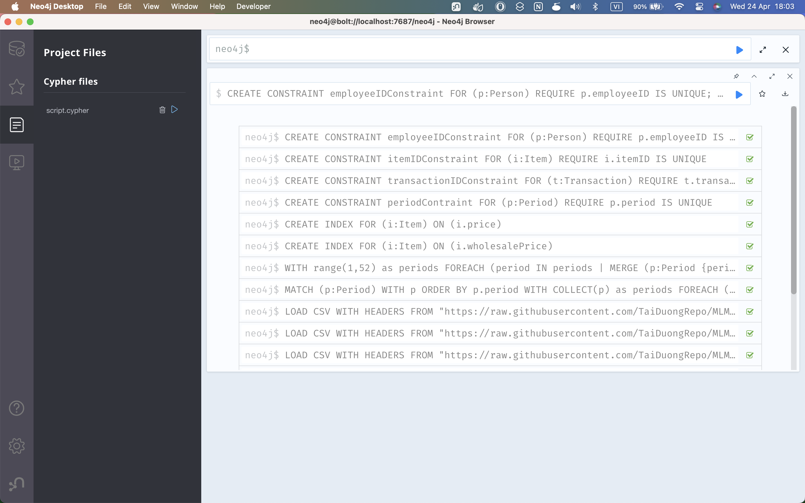

# Xây dựng hệ thống kinh doanh đa cấp sử dụng Neo4j

Nội dung: Sử dụng Neo4j cho việc xây dựng hệ thống kinh doanh đa cấp, sử dụng cấu trúc cây để mô tả việc dòng tiền thu nhập của các cộng tác viên khi chuyển lên các đại lý cấp trên.

## Using Neo4j

### Setup

Cài đặt Neo4j Desktop và tạo một cơ sở dữ liệu mới.
Thêm file `script.cypher` trong folder `src` vào cơ sở dữ liệu.

### Import Data

Chạy file `script.cypher` để tạo dữ liệu mẫu.

